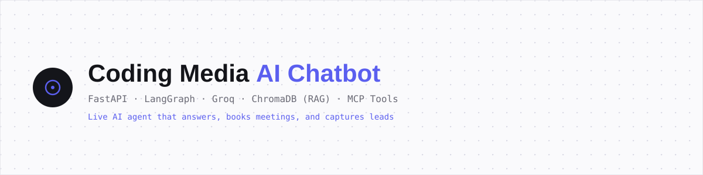

# Coding Media — AI Chatbot



An AI chatbot that doesn't just answer questions — it books meetings, captures leads, and remembers returning clients. Built for a real IT services agency, deployed live on free-tier infrastructure.

**[🟢 Live Demo](https://lokeshkumawat01.github.io/coding-media-ai-chatbot/widget/index.html)** · **[Backend API](https://coding-media-bot-api.onrender.com/health)** · **[Admin Panel](https://lokeshkumawat01.github.io/coding-media-ai-chatbot/admin_dashboard/index.html)**

---

## What it does

- **Answers from real knowledge** — RAG over the agency's actual services/FAQ docs, not hallucinated facts
- **Books meetings** — checks live Google Calendar availability, books the slot, auto-cancels/replaces if the client reschedules
- **Captures leads** — creates a client profile + order in PostgreSQL, with duplicate-lead detection
- **Remembers clients** — merges past orders + human call notes into one context for returning clients
- **Admin dashboard** — JWT-protected panel to view leads, meetings, unanswered queries, and log call notes
- **Encrypted at rest** — sensitive fields (requirements, call notes) are transparently encrypted at the ORM layer
- **Embeddable anywhere** — a single dependency-free `<script>` tag, works on WordPress, Webflow, or plain HTML

## Architecture

User message
↓
Website Widget (Shadow DOM, vanilla JS)
↓
FastAPI Gateway (CORS, rate limiting, daily quota cap)
↓
Redis (cache check + conversation history)
↓
LangGraph Agent (Groq, native tool-calling)
↓ ↓ ↓
ChromaDB MCP Tools Direct answer
(RAG) (7 tools: lead
capture, booking,
calendar, client
context, etc.)
↓
PostgreSQL (leads, meetings, call notes) + Email notifications
↓
Response → back to widget


## Tech stack

| Layer | Technology |
|---|---|
| Backend | FastAPI (async), Uvicorn |
| Orchestration | LangGraph — agent + tool node |
| LLM | Groq (`openai/gpt-oss-120b`), native tool-calling |
| RAG | ChromaDB + HuggingFace multilingual embeddings |
| Tool protocol | MCP (Model Context Protocol) |
| Database | PostgreSQL (Supabase) + SQLAlchemy async + Alembic |
| Cache | Redis (Upstash) |
| Calendar | Google Calendar API |
| Auth | JWT + bcrypt (admin panel) |
| Frontend | Vanilla JS, Shadow DOM — zero framework |
| Hosting | Render (API) · GitHub Pages (widget/admin) — all free tier |

## Project structure

app/
├── main.py # FastAPI entrypoint
├── config.py # Settings (env vars)
├── core/ # DB, Redis, JWT, rate limiting, encryption
├── models/ # SQLAlchemy models
├── rag/ # ChromaDB + embeddings
├── mcp_tools/ # 7 MCP tools + Google Calendar client
├── agent/ # LangGraph agent + system prompt
├── routes/ # /api/chat, /api/admin/*
└── utils/ # logger, email notifications
widget/ # Embeddable chat widget
admin_dashboard/ # Admin panel (static HTML)
scripts/load_knowledge_base.py # PDF/DOCX → ChromaDB ingestion
knowledge_base/ # Source docs (FAQ, services, case studies)
alembic/ # DB migrations


## Running locally

```bash
git clone https://github.com/lokeshkumawat01/coding-media-ai-chatbot.git
cd coding-media-ai-chatbot
python -m venv venv
venv\Scripts\activate      # Windows
pip install -r requirements.txt

cp .env.example .env       # fill in your own keys — see below

alembic upgrade head
uvicorn app.main:app --reload --port 8000
```

### Environment variables

See `.env.example` for the full list. You'll need free accounts for:
- [Groq](https://console.groq.com) — LLM inference
- [HuggingFace](https://huggingface.co/settings/tokens) — embeddings API
- A PostgreSQL database (local or [Supabase](https://supabase.com) free tier)
- A Redis instance (local or [Upstash](https://upstash.com) free tier)
- A Google Cloud service account with Calendar API enabled

## Deployment

Deployed entirely on free tiers:
- **API** → Render (Python web service)
- **Database** → Supabase (PostgreSQL, with Row-Level Security enabled)
- **Cache** → Upstash (Redis)
- **Widget/Admin** → GitHub Pages (static hosting)

## Known limitations

- WhatsApp channel integration is scoped but not built (website-only currently)
- No automated test suite — testing was manual/scripted during development
- Render's free tier has a cold-start delay (~30-60s) after inactivity

## Author

**Lokesh** — Python Developer · B.Tech CS, Poornima University
[GitHub](https://github.com/lokeshkumawat01)